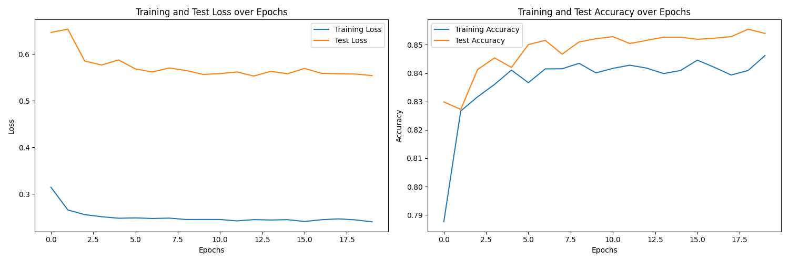

# Sarcasm Detection Using NLP 🚀  
**Detecting sarcasm in text using BERT & LSTM models for Natural Language Processing**

*A project focused on identifying sarcastic statements in textual data using advanced NLP techniques.*

---

## 🔍 Project Summary 

This repository contains an implementation of two deep learning models — **BERT** and **LSTM** — trained to detect sarcasm in news headlines. The models were evaluated based on accuracy, precision, recall, F1-score, and confusion matrices.

| Model | Accuracy | Precision | Recall | F1-Score |
|-------|----------|-----------|--------|----------|
| BERT  | 91.5%    | 88.1%     | 93.3%  | 90.6%    |
| LSTM  | 84.8%    | 80.8%     | 85.9%  | 83.2%    |

---

## 📁 Dataset

- **Source**: Kaggle News Headlines dataset.
- **Description**: Contains real-world news headlines labeled as sarcastic (`1`) or not (`0`).
- **Split**: Training (80%) and Testing (20%).

---

## ⚙️ Methodology

### Preprocessing:
- Tokenization
- Lowercasing
- Stopword removal
- Padding / Truncating sequences

### Models Used:
- **BERT Base Uncased** (Pretrained Transformer)
- **Bidirectional LSTM** (RNN-based architecture)

### Evaluation Metrics:
- Confusion Matrix
- Accuracy
- Precision
- Recall
- F1 Score

---

## 📈 Results Overview

### ✅ BERT Model Performance
- **Accuracy**: ~91.5%
- **F1 Score**: ~90.6%

#### Confusion Matrix:


#### Training Curves:


---

### 📉 LSTM Model Performance
- **Accuracy**: ~84.8%
- **F1 Score**: ~83.2%

#### Confusion Matrix:


#### Training Curves:


---

## 🧪 Key Observations

- **BERT outperformed LSTM**, showing better generalization and higher classification scores.
- LSTM and BERT showed signs of **overfitting**, as seen from the training vs validation loss curves.
- Both models achieved decent results, but transformer-based models like BERT are more effective at capturing context and nuance in language.
- LSTM shows faster training but lower overall performance

---

## 🛠 Future Improvements

- Fine-tune BERT with domain-specific datasets.
- Implement RoBERTa or DistilBERT for comparison.
- Use attention visualization to understand what parts of sentences influence predictions.
- Add support for multi-class sarcasm intensity detection.

---

## 📦 Project Structure
```shall
📂 sarcasm-detection/
├── 📁 data/                  # Download Dataset files
├── 🤖 best_model_bert/       # Model checkpoint for BERT (not uploaded)
├── 🧠 best_model_lstm/       # Model checkpoint for LSTM
├── 💻 src/                   # Source code
├── 📊 runs/                  # For logging by tensorboard
├── 🖼️ images/                # For models plots and confusion matrix
├── 📓 notebooks/             # Jupyter notebooks
├── ⚙️ config/                # Configuration
├── 📜 requirements.txt       # Dependencies
└── 📖 README.md              # This file
```
